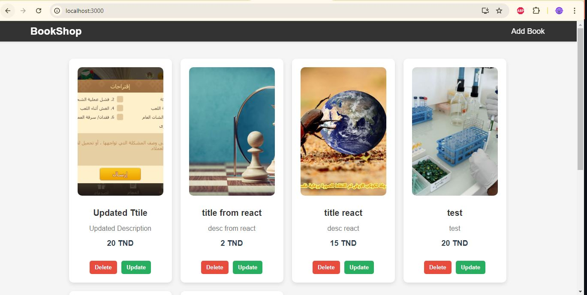

### `README.md`


# Book Shop Application

## Description

This is a Book Shop application built with React, Express, and MySQL. It allows users to manage books, including adding, updating, and deleting entries. The application features a user-friendly interface with image uploads and CRUD operations.

## Features

- **Add Books**: Add new books with title, description, price, and cover image.
- **Update Books**: Modify details of existing books.
- **Delete Books**: Remove books from the collection.
- **View Books**: Display all books in a grid layout with their details and cover images.

## Technologies Used

- **Frontend**: React, React Router
- **Backend**: Express, MySQL
- **Styling**: CSS, SweetAlert2 for confirmations

## Installation

### Prerequisites

- Node.js
- MySQL

### Backend Setup

1. Clone the repository:
   ```bash
   git clone https://github.com/yourusername/yourrepository.git
   ```
2. Navigate to the backend directory:
   ```bash
   cd backend
   ```
3. Install dependencies:
   ```bash
   npm install
   ```
4. Configure the database:
   - Create a database named `ebook-learn`.
   - Import the provided SQL schema into the database.

5. Start the backend server:
   ```bash
   npm start
   ```

### Frontend Setup

1. Navigate to the frontend directory:
   ```bash
   cd frontend
   ```
2. Install dependencies:
   ```bash
   npm install
   ```
3. Start the frontend server:
   ```bash
   npm start
   ```

## Usage

- **Home**: View all books.
- **Add New Book**: Navigate to `/add` to add a new book.
- **Update Book**: Navigate to `/update/:id` to update an existing book.
- **Delete Book**: Click "Delete" to remove a book after confirmation.

## Images

Below are some screenshots of the application:

### Home Page


### Add Book Page


### Update Book Page


